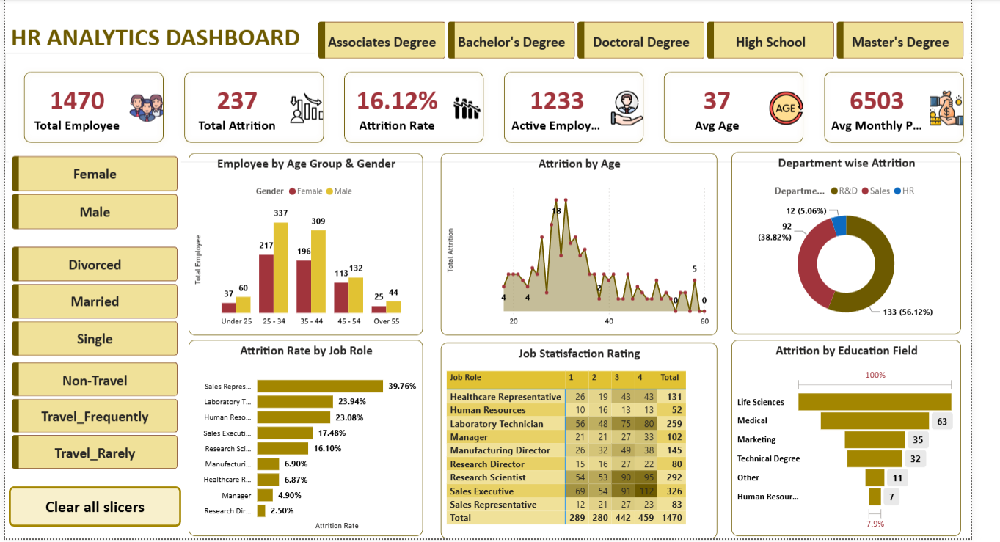

# HR Analytics Dashboard

## 📌 Project Overview
This project is an interactive HR Analytics Dashboard built using **Power BI** to analyze employee attrition, workforce demographics, job satisfaction, and departmental performance.

## 📊 Dashboard Preview

## 🎯 Business Problem
Organizations need to understand employee attrition and workforce trends to improve retention and make data-driven HR decisions.

## 📈 Key KPIs
- Total Employees
- Active Employees
- Total Attrition
- Attrition Rate
- Average Age
- Average Monthly Income

## 📊 Dashboard Features
- Employee distribution by Age Group & Gender
- Attrition by Age
- Department-wise Attrition
- Attrition Rate by Job Role
- Job Satisfaction Analysis
- Attrition by Education Field
- Interactive slicers for:
  - Gender
  - Education
  - Marital Status
  - Business Travel

## 🛠 Tools Used
- Power BI
- DAX
- Power Query
- Microsoft Excel

## 📁 Files Included
- HR Analytics Dashboard.pbix
- Company Data.xlsx
- HR Analytics Dashboard.pdf

## 🚀 Key Insights
- R&D department has the highest employee attrition.
- Sales Representatives have the highest attrition rate.
- Employees aged 25–34 account for the largest workforce segment.
- Job satisfaction varies significantly across different job roles.

---
Created by **Yash Kumar**
